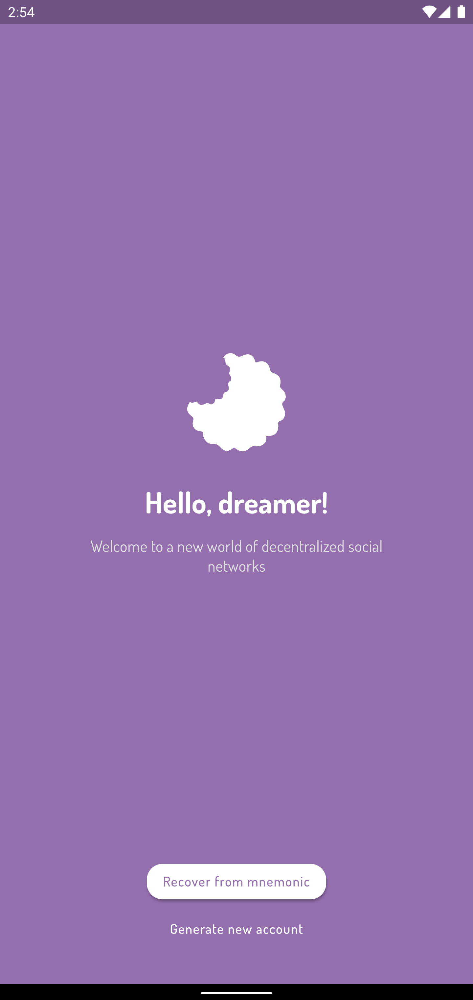
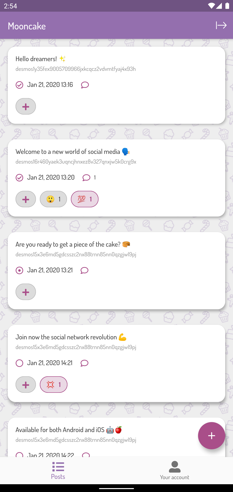
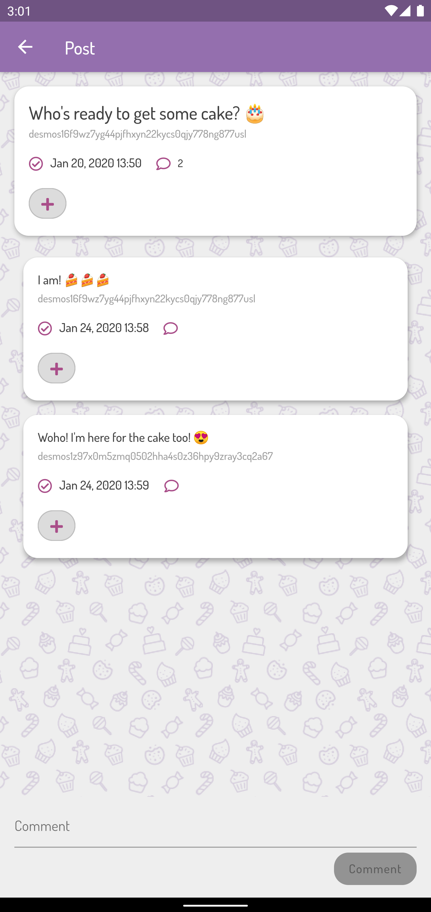

## Introduction
Mooncake, which name derives from the homonym [chinese bakery product](https://en.wikipedia.org/wiki/Mooncake), is a decentralized social application based on the [Desmos blockchain](https://github.com/desmos-labs/desmos).

It allows to post freely and anonymously any kind of message, and to see what all the users are writing without having to follow or be friend with anyone. 

Everyone reads everything, but none knows who is who. 

> Are you ready to enter a new world of social networks? 

## Download
Downloads and documentation can both be found on the [official website](https://mooncake.space)

 

## Screens
  

## Development
You can read more about the development on the [official website](https://mooncake.space/development).

## Caveats
### Syncing
As of today, the syncing of posts and reactions is performed **once every 30 seconds**.  
This is due to avoid uploading or downloading new content too much quickly. 

For users, this means that everything you do **will stay on your device for 30 seconds**. After that time, it will be sent to the chain and will be public.  

## Disclaimer
Some of the code inside this repo has been taken and adapted from the awesome [Flutter Twitter clone project](https://github.com/TheAlphamerc/flutter_twitter_clone).
